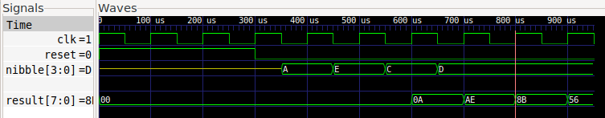

<!--
# SPDX-FileCopyrightText: 2023 Anton Maurovic <anton@maurovic.com>
#
# Licensed under the Apache License, Version 2.0 (the "License");
# you may not use this file except in compliance with the License.
# You may obtain a copy of the License at
#
#      http://www.apache.org/licenses/LICENSE-2.0
#
# Unless required by applicable law or agreed to in writing, software
# distributed under the License is distributed on an "AS IS" BASIS,
# WITHOUT WARRANTIES OR CONDITIONS OF ANY KIND, either express or implied.
# See the License for the specific language governing permissions and
# limitations under the License.
# SPDX-License-Identifier: Apache-2.0
-->

[](https://opensource.org/licenses/Apache-2.0)   

# anton1-tt03: "Simple Multiply" submission for Tiny Tapeout 3 (TT03)

This is a very simple example of a tiny Verilog design which will hopefully be made into part of an ASIC (i.e. a real silicon chip)
through the [Tiny Tapeout](#what-is-tiny-tapeout) program.

It implements what could be considered a primitive state machine that takes in two 8-bit numbers (clocked in one nibble at a time),
and then gives the 16-bit product (clocked out one byte at a time), before then repeating this process.



The waveform above shows two operands being clocked in: `0xAE`, then `0xCD`. Then starting at 800&micro;s it starts clocking out the result: `0x8B56`.

Building this is normally done automatically via GitHub Actions, but more info about this is provided below.

NOTE:
*   You can configure the size of each input operand via `OP_NIBBLES` in both [`product.v`](./src/product.v)
and [`test.py`](./src/test.py). It is currently set to 2.
*   I can't currently get it to fit more than 3-nibble operands in the designated Tiny Tapeout area.
*   `./tt/tt_tool.py --print-stats` gives below utilisation stats for different nibble counts.
    NOTE: Cell count comes from `runs/wokwi/reports/synthesis/1-synthesis.AREA_0.stat.rpt`
    | `OP_NIBBLES`  | Utilisation (%) | Wire length (um) | Cell count |
    |---------------|-----------------|------------------|------------|
    | 1             |  4.96           |  6436            |  101       |
    | 2             | 18.98           | 14093            |  415       |
    | 3             | 41.04           | 25601            |  897       |
    | 4 (Fails fit) | 71.98           | -1               | 1586       |


## What's in this repo?

The main things are:

*   [`.github/workflows`](.github/workflows/): contains workflow scripts, for running automated tasks via GitHub Actions, on push.
*   `src/`:
    *   [`product.v`](./src/product.v):     Main Verilog source code implementing this design (a module called `algofoogle_product`).
    *   [`tb.v`](./src/tb.v):               Verilog testbench that is used by cocotb tests, basically as an adapter to interface with the design and capture signal waveforms in `tb.vcd`.
    *   [`test.py`](./src/test.py):         Python script used by cocotb to run our tests.
    *   [`Makefile`](./src/Makefile):       Used by `make` or `make GATES=yes` to run tests.
    *   [`tb2.gtkw`](./src/tb2.gtkw):       "Save File" for GTKWave; config for how to display `tb.vcd`.
    *   [`config.tcl`](./src/config.tcl):   Generic config for OpenLane (TT standard; should not be modified).
    *   `cells.v`:                          Ignore this one; only used for Wokwi-based designs (which this isn't).
*   [`info.yaml`](./info.yaml):             Tiny Tapeout standard project information about this repo, inc. source files and basic documentation.


## Running tests

The `src` directory contains not only the main Verilog source code, but also a `Makefile`.

If you run `make` while the correct tools are installed, it should put the verilog through a few simple
tests that sequentially load and retrieve data from the design, to exercise a few multiplications.

Running this will also create a `tb.vcd` file of the signal waveforms, that can be viewed with GTKWave:
```bash
gtkwave tb.vcd tb2.gtkw
```

Note that running tests requires that Python is installed, along with `cocotb` and `iverilog`.

The GitHub Actions (see below) can provide more tips on what you need to install for running tests.
They also reveal how you could set up a run of `make GATES=yes` to run a GL (Gate-Level) test.
If you can't run things locally, you could just rely on the GitHub Actions to run your tests,
generate your GDS, and show you what the final layout looks like.


## Building with GitHub Actions and submitting to TT

NOTE: TT designs can be made using an HDL (e.g. Verilog, as this design is) or through schematic capture using [Wokwi](https://wokwi.com/).
There is a [specific guide for using Wokwi to make Tiny Tapeout designs](https://tinytapeout.com/digital_design/wokwi/),
but this design is a fork of [`tt03-verilog-demo`](https://github.com/TinyTapeout/tt03-verilog-demo).

There are GitHub Actions [we can look to](https://github.com/algofoogle/anton1-tt03/tree/main/.github/workflows) which
run the build process for us, via GitHub, each time there is a push to the repo.

Note that you might want to read the following two articles:
* [Enabling GitHub Actions](https://tinytapeout.com/faq/#when-i-commit-my-change-the-gds-action-isnt-running)
* [Enabling GitHub Pages](https://tinytapeout.com/faq/#my-github-action-is-failing-on-the-pages-part)

Artifacts produced by these Actions include:
*   Test results: Both cocotb result text ([see here for an example](https://github.com/algofoogle/anton1-tt03/actions/runs/4789489834/jobs/8517428549); expand the `test` step) and `test-vcd.zip` file containing the `.vcd` file of signals simulated during the test.
*   Documentation: PDF of the "datasheet" for this design, built from information in [`info.yaml`](./info.yaml).
*   GDS: The main affair. Actual GDS (blueprint) to be included in the overall TT chip for manufacturing, with both 2D and 3D previews.
    Also, GL (Gate-Level) test results built from the GDS.

All 3 must succeed before the design is eligible to submit to TT. Once you've confirmed that, if a TT round is open,
you should be able to go to the submission page and paste in the URL of your GitHub repo, and it will verify that
everything is good. I won't provide too much detail on this because it might change in TT04.


## Building GDS locally

Being able to build locally is a great way to quickly identify synthesis or fit issues, instead of
having to wait for the GitHub Actions to complete.

I'm using the "MPW8 VM" supplied by Matt Venn via the [Zero to ASIC course](https://zerotoasiccourse.com),
which is an Ubuntu 20.04 LTS VM that comes with *most* of the necessary tools installed, but you can potentially
figure out what you need to set up by looking at the [GitHub Actions](https://github.com/algofoogle/anton1-tt03/tree/main/.github/workflows).

Here's what I specifically needed to do, when using the MPW8 VM:

1.  Clone this repo.
2.  Go into it, then clone the [tt-support-tools](https://tinytapeout/tt-support-tools) repo into a subdirectory called `tt`: `git clone git@github.com:tinytapeout/tt-support-tools tt`
3.  I already have these environment variables defined:
    | var                     | value |
    |-------------------------|---|
    | `OPENLANE_IMAGE_NAME`   | `efabless/openlane:cb59d1f84deb5cedbb5b0a3e3f3b4129a967c988-amd64` |
    | `OPENLANE_ROOT`         | `/home/zerotoasic/asic_tools/openlane` |
    | `PDK_ROOT`              | `/home/zerotoasic/asic_tools/pdk` |
    | `PDK`                   | `sky130A` |

    ...if you're setting up from scratch, though, see the top of the [`gds` workflow](https://github.com/algofoogle/anton1-tt03/blob/main/.github/workflows/gds.yaml) for values, and note that references to `runner` is specific to the environment of the GitHub Action itself.
4.  Install Python stuff needed by TT: `pip install -r tt/requirements.txt`
5.  Run: `./tt/tt_tool.py --create-user-config`
    *   Outputs: `2023-04-26 06:08:07,817 - project    - INFO     - creating include file`
    *   Contents of `src/user_config.tcl`:
        ```tcl
        set ::env(DESIGN_NAME) algofoogle_product
        set ::env(VERILOG_FILES) "\
            $::env(DESIGN_DIR)/product.v"
        ```
6.  Run: `./tt/tt_tool.py --harden`
7.  Results are in `runs/wokwi/`, with these warnings:
    ```
    [WARNING]: Current core area is too small for the power grid settings chosen. The power grid will be scaled down.
    [WARNING]: There are max fanout violations in the design at the typical corner. Please refer to '../work/runs/wokwi/reports/signoff/25-rcx_sta.slew.rpt'.
    ```
    Generally these can be ignored: The core area warning is to be expected, and in the case of this repo
    the fanout is just a clock buffer going 1 over, which from what others have advised is still OK.
8. Summaries:
    *   `./tt/tt_tool.py --print-warnings` -- No output
    *   `./tt/tt_tool.py --print-stats` -- 18.35% utilisation (just for routing?) with wire length of 13563um.
    *   `./tt/tt_tool.py --print-cell-category` -- Hard to read because it's a Markdown table with URLs, but it appears to be the same numbers as what the official build did in GHA.
    *   `./tt/tt_tool.py --create-png` -- Creates a PNG of the GDS.


## Possible improvements

*   Include the proper license in all source files.
*   Support more bits, i.e. larger operand and hence larger result. Make this selective based on another input pin?
*   The design could probably already start clocking out the first output byte while receiving the last input nibble; 1 fewer cycles needed.
*   There is an SHL-8 (shift-left by 8 bits, i.e. `<<8`) that might synthesise to slightly fewer standard cells if we
    accept that we don't actually need to set the lower 8 bits to 0.
*   Would some sort of progressive multi-step multiply mean smaller multiply logic and hence could support more bits?
*   If we're really space-constrained, we could drop `product <= 0` during reset.
*   Try targeting an FPGA.


## What is Tiny Tapeout?

TinyTapeout is an educational project that aims to make it easier and cheaper than ever to get your digital designs manufactured on a real chip!

Go to https://tinytapeout.com for instructions!

General constraints of this 3rd TT round are that the design must fit in 150&micro;m &times; 170&micro;m (which allows for ~1000
standard cells using sky130A),
and can use up to 8 distinct inputs, 8 distinct outputs. Clock and reset signals (if required) must be a part of the 8 inputs.
Additionally, because of the "scan chain" of the whole Tiny Tapeout chip (i.e. how 250 separate designs must share the available
chip area and IOs), the maximum IO speed is limited to somewhere between 6kHz and 70kHz (to be proven).

NOTE: For TT04 it is expected that clock/IO speeds, available design area, and number of IOs will be notably higher.


## Resources

* [Tiny Tapeout FAQ](https://tinytapeout.com/faq/)
* [Digital design lessons](https://tinytapeout.com/digital_design/)
* [Learn how semiconductors work](https://tinytapeout.com/siliwiz/)
* [Join the community](https://discord.gg/rPK2nSjxy8)
